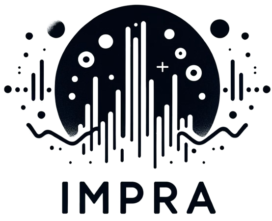

<p align="center">
    
    <br>
    <span style="font-size: 30px;">ImpRA: Impulse Response Analyzer</span>
</p>

## 🔍 Overview
This software enables the characterization of room impulse responses through a fast algorithm for calculating acoustic parameters. It supports the analysis of both mono and stereo signals. Additionally, users can visualize the energy curve and a table displaying the results of the acoustic parameters.


## ✨ Features

- Processing of monophonic and binaural signals
- Analysis by octave and third-octave bands
- Option to invert the room impulse response before filtering (Kirkeby method)
- Smoothing through various methods (Schroeder, Moving Median Filter)
- Downloading of data on calculated parameters in .csv file


## 🔧 Installing

### 📋 Prerequesites


> **Python version**:
This project requires Python version 3.9 or higher. Ensure that your system has the appropriate version installed before proceeding.

> **Poetry:**
Used for dependency management and packaging in this project. Visit the [official Poetry installation guide](https://python-poetry.org/docs/#installation) for instructions tailored to your operating system.


### 📦 Package installation
1. Download the repository
    ```bash
    git clone https://github.com/nahue-passano/ImpRA.git
    cd ImpRA
    ```

2. Create the [poetry](https://python-poetry.org/) environment
    ```bash
    poetry install
    ```

## 🚀 Usage
1. Initialize the poetry environment
   ```bash
    poetry shell
   ```
   
2. Run the streamlit app
    ```bash
    streamlit run impra/app/app.py
    ```
> Note: Please ensure you are located within the ImpRA folder before running the streamlit app.


## 📄 License

This project is licensed under the GNU General Public License v2 (GPLv2). This license allows you the freedom to use, modify, and distribute this software, under the terms specified in the GPL v2.

For more details on your rights and restrictions under this license, please refer to the full text of the GPL v2 here: [GNU General Public License v2 (GPLv2)](https://www.gnu.org/licenses/old-licenses/gpl-2.0.en.html).

[](https://www.gnu.org/licenses/old-licenses/gpl-2.0.en.html)
